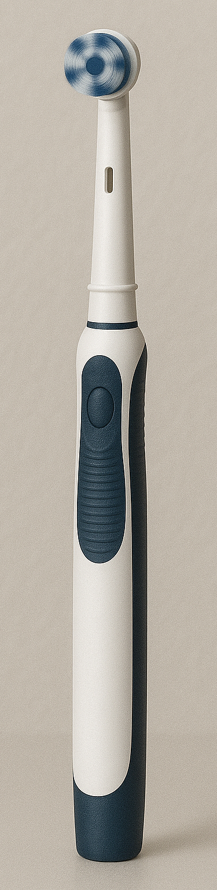

# ATtiny85 Toothbrush Firmware 🪥⚡


<!--  -->

> Bare-metal C firmware that turns an ATtiny85 into a three-speed  
> electric-toothbrush controller.  
> **Short press → cycle speeds · Long press → start / stop & ultra-low-power sleep**

---

## ✨ Features

| Category | Highlights |
|----------|------------|
| Deterministic PWM | Phase-correct Timer 0 (~16 kHz on PB0) |
| Three Speed Levels | 100 % · 66 % · 33 % duty via lookup table |
| One-Button UI | INT0 ISR, short vs ≥ 2 s long press |
| Ultra-Low Power | \< 2 µA in `SLEEP_MODE_PWR_DOWN` when stopped |
| Modular Drivers | `motor`, `button`, `power` APIs |
| CI Build | GitHub Actions builds every push |

---

## 🛠 Build & Flash

```bash
git clone https://github.com/dondfx/attiny85-toothbrush.git
cd attiny85-toothbrush
platformio run             # builds firmware.hex
platformio run -t upload   # flash with USBtinyISP
```

## 🔥 Fuse Settings

```text
LFUSE 0xE2   HFUSE 0xD7   EFUSE 0xFF

To burn the fuses, use this command (replace -c usbtiny if you're using a different programmer):
avrdude -p attiny85 -c usbtiny -U lfuse:w:0xE2:m -U hfuse:w:0xD7:m -U efuse:w:0xFF:m
```

## 📁 Project Structure

```text
attiny85-toothbrush/
├── include/        → Header files (motor.h, button.h, power.h)
├── src/            → Source code: drivers + main
├── hardware/
│   ├── gerbers/    → PCB manufacturing files
│   ├── step/       → 3D STEP model of the PCB
│   └── docs/       → Wiring diagram & connection info (PDF)
├── .github/        → GitHub Actions CI workflow
├── platformio.ini  → PlatformIO project config
├── BOM.md          → Bill of Materials with footprints
└── README.md       → This documentation 
```
